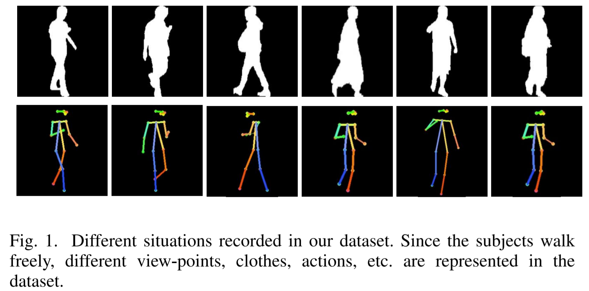

# ReSGait: The real scene gait dataset

### Overview
Many  studies  have  shown  that  gait  recognition  canbe  used  for  identifying  humans  at  long  distance  with  promisingresults on current datasets. However, those datasets are collectedunder controlled situations and predefined conditions, what limitsresult  extrapolation  to  unconstrained  situations  where  subjectswalks  freely  in  the  scene.  Moreover,  in  an  unconstrained  scenethere  exist  uncontrollable  variables  such  as  illumination,  view-point, temperature, actions performed by the subjects, etc., thataffect  directly  or  indirectly  to  the  walking  pattern  –  people  donot  walk  in  the  same  way  while  they  are  talking  by  phone  orjust  walking  in  a  direction.  In  order  to  evaluate  unconstrainedscenarios,  we  release  a  novel  real-scene  gait  dataset  (ReSGait),which  is  the  first  one  collected  in  a  unconstrained  scenariowithout controlling any parameter of the environment. Therefore,in our dataset, the subjects perform actions such as phone calling,jumping,  etc.  while  they  walk.  In  addition,  they  can  wear  theclothes  they  want,  there  are  changes  in  the  view-point  due  tothe  walking  path,  changes  in  the  appearance  due  time  span,and  many  other  situations  that  make  this  dataset  one  of  themost  realistic  and  difficult  ones  in  the  literature.  Overall,  ourdataset  is  composed  of  172  subjects  and  870  video  sequences,with 5 videos per subject on average, recorded along 15 months,with an average time span per subject of 135 days. Besides, thevideos were labelled with gender, clothing, carrying, the kind ofwalking  route  and  holding  a  mobile  phone  or  not.  Therefore,the main characteristics of our dataset that differentiate it fromother  datasets  are:  (i)  uncontrolled  real  life  scenes  and  (ii)  longrecording time. Finally, we empirically assess the difficulty of theproposed  dataset  by  evaluating  state-of-the-art  gait  approachesfor silhouette and pose modalities. Those results are below 35% ofaccuracy. It demonstrates the difficulty of our dataset comparedto current other datasets, where accuracies are higher than 90%.Thus,  our  proposed  dataset  establishes  a  new  level  of  difficultyin the gait recognition problem, which is much closer to real life.

## The performance of existing SOTA methods on ReSGait
...